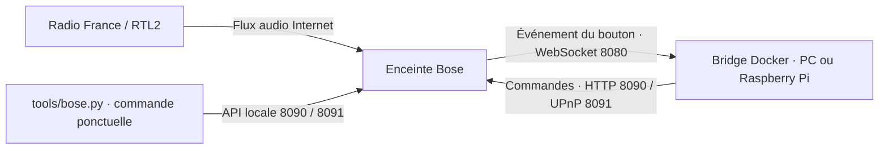

# Bose SoundTouch : radios

Faire fonctionner les boutons des trois SoundTouch 10 avec un petit bridge
Docker sur le réseau de la maison. Aucun Home Assistant ni MQTT n'est nécessaire.

| Bouton | Lecture | Qui s'en charge ? |
| --- | --- | --- |
| **1** | France Inter en direct | Le bridge lance la radio |
| **2** | France Info en direct | Le bridge lance la radio |
| **3** | RTL2 en direct | Le bridge lance la radio |
| **4–6** | Vides, réservés pour un futur usage | Aucune affectation |

Les boutons 4/5/6 sont vides sur les trois enceintes.

## Comment ça fonctionne

Docker lance **un conteneur**, service `bose-bridge`, qui exécute
`python3 -u /bridge.py`, la commande standard de l'image du
[bridge communautaire de sandervg](https://github.com/sandervg/homeassistant-bose-soundtouch-bridge),
version **1.8.5**, dont l'image est fixée par empreinte dans `compose.yaml`.
Ce dépôt fournit sa configuration et un outil de commande complémentaire.
Le conteneur utilise directement le bridge communautaire.

1. Le bridge se connecte à chaque enceinte et attend les événements de ses boutons.
2. Un appui court sur **1, 2 ou 3** lui fait envoyer l'adresse de la radio à cette Bose.
3. **La Bose télécharge et lit elle-même le flux audio.** Le son ne transite pas par le PC ou le Raspberry Pi.



### Quels ports ?

**Le bridge n'ouvre aucun serveur TCP sur l'hôte : aucun port d'interface web
ou d'API à visiter.** Il ouvre des connexions sortantes vers les ports des Bose :

| Port sur chaque Bose | Usage |
| --- | --- |
| **8080/TCP** | Connexion WebSocket persistante : recevoir les appuis sur les boutons |
| **8090/TCP** | API Bose : informations, presets et commandes natives |
| **8091/TCP** | UPnP : demander la lecture d'une radio |

Le conteneur partage le réseau de l'hôte (`network_mode: host`). La découverte
UPnP peut aussi utiliser SSDP, multicast UDP vers le port 1900. Tout reste sur
le LAN pour le pilotage ; Internet est nécessaire pour les radios.
Aucune redirection de ports sur la box n'est nécessaire.

### Faut-il laisser la machine allumée ?

**Oui, pour les radios sur 1/2/3.**
Docker maintient le bridge en arrière-plan, même après fermeture du terminal.
Si le bridge s'arrête, une lecture déjà lancée peut continuer.

## Installation sur Raspberry Pi

Prévoir un Pi compatible **ARM64**, avec **Raspberry Pi OS 64 bits**, sur le même
LAN que les Bose. L'image choisie existe pour `linux/arm64` et `linux/amd64` ;
aucune compilation n'est nécessaire. Le bridge a été installé sur un Raspberry Pi 5.

1. Installer Docker Engine et le plugin Compose en suivant la
   [procédure officielle Debian pour Raspberry Pi OS 64 bits](https://docs.docker.com/engine/install/debian/).
   Installer aussi Git et Python 3.10 ou plus pour l'utilitaire local :

   ```bash
   sudo apt update
   sudo apt install -y git python3
   sudo systemctl enable --now docker
   docker compose version
   ```

2. Cloner le dépôt GitHub :

   ```bash
   git clone https://github.com/orel33/bose.git
   cd bose
   docker compose config --quiet
   docker compose pull
   ```

3. Vérifier les IP des enceintes dans `compose.yaml` (`SPEAKERS_JSON`). Pour ce
   réseau, réserver ces adresses dans la box afin qu'elles restent stables :

   | Enceinte | Adresse |
   | --- | --- |
   | Bose Veranda | `192.168.0.152` |
   | Bose Cuisine | `192.168.0.151` |
   | Bose Chambre | `192.168.0.111` |

   Si les IP changent, adapter aussi la liste `HOSTS` de `tools/bose.py`.

4. **Avant de démarrer sur le Pi, arrêter l'ancien bridge sur le PC** avec
   `docker compose down`, depuis son dossier `bose`. Une seule instance doit
   piloter ces enceintes pour éviter des commandes de lecture concurrentes.

5. Sur le Pi, avec les Bose accessibles :

   ```bash
   docker compose up -d
   docker compose logs --tail 50 -f
   ```

   Attendre un message `ws connected` pour chaque IP, puis essayer les boutons.
   `Ctrl+C` quitte l'affichage des logs, pas le bridge. Si Docker demande des
   droits supplémentaires, préfixer les commandes `docker` par `sudo`.

La politique `restart: unless-stopped` relance le conteneur avec Docker après
un redémarrage du Pi, sauf s'il a été arrêté volontairement. Garder le Pi allumé
et éviter sa mise en veille. Si une Bose était indisponible au démarrage et
n'apparaît pas connectée dans les logs, la rallumer puis lancer
`docker compose restart`.

## Utilisation et réglages

Les noms et adresses des radios sont dans [`config/radios.env`](config/radios.env).
Après modification, appliquer la configuration avec `docker compose up -d`.
Les boutons **1/2/3 ne sont pas réécrits au démarrage** : le bridge charge leurs
URL et utilise les événements des presets déjà enregistrés.
La synchronisation `SYNC_PRESETS_ON_STARTUP` reste désactivée : le bridge
ne modifie aucun preset au démarrage.
Les boutons 4/5/6 restent sans URL.

> [!WARNING]
> **RTL2 : publicité au démarrage (« pré-roll »).** Le flux utilisé passe par
> Audiomeans et peut diffuser une publicité avant de rejoindre le direct.
> Chaque nouvel appui sur le bouton **3** arrête puis reconnecte le flux : il peut
> donc déclencher une nouvelle publicité, donnant l'impression de revenir en
> arrière. Ce comportement peut être lié au pré-roll plutôt qu'à un problème de
> buffering. Éviter les appuis répétés lorsque RTL2 joue déjà.

```bash
docker compose ps                 # État du conteneur
docker compose logs --tail 50      # Connexions et derniers appuis
docker compose restart            # Redémarrer le bridge
docker compose down               # Arrêter et retirer le conteneur
```

L'arrêt du conteneur ne supprime pas les presets. Les logs sont
limités à trois fichiers de 5 Mo. Un conteneur « Up » doit aussi avoir ses
connexions `ws connected` pour rendre les boutons opérationnels.

## Flux radio et écoute directe sous Linux

Les adresses ci-dessous correspondent à [`config/radios.env`](config/radios.env).
Les trois flux sont au format MP3, à 128 kbit/s.

| Bouton | Radio | URL du flux | Destination après redirection |
| --- | --- | --- | --- |
| **1** | France Inter | `http://direct.franceinter.fr/live/franceinter-midfi.mp3` | `http://icecast.radiofrance.fr/franceinter-midfi.mp3` |
| **2** | France Info | `http://direct.franceinfo.fr/live/franceinfo-midfi.mp3` | `http://icecast.radiofrance.fr/franceinfo-midfi.mp3` |
| **3** | RTL2 | `http://icecast.rtl2.fr/rtl2-1-44-128` | Audiomeans (`streaming-ice.audiomeans.fr`) |

Pour écouter sur l'ordinateur Linux, installer **mpv**. Sur Debian, Ubuntu ou
Raspberry Pi OS :

```bash
sudo apt install mpv
```

Lancer **une** des commandes suivantes dans un terminal :

```bash
# France Inter
mpv --no-video 'http://direct.franceinter.fr/live/franceinter-midfi.mp3'

# France Info
mpv --no-video 'http://direct.franceinfo.fr/live/franceinfo-midfi.mp3'

# RTL2
mpv --no-video 'http://icecast.rtl2.fr/rtl2-1-44-128'
```

Appuyer sur **q** ou **Ctrl+C** pour arrêter. Cette écoute utilise la sortie audio
de l'ordinateur, sans Docker ni enceinte Bose. Les redirections sont suivies
automatiquement ; le pré-roll RTL2 peut également se produire avec ce lecteur.
Voir la [documentation de mpv](https://mpv.io/manual/stable/).

Avec **VLC**, ouvrir **Média → Ouvrir un flux réseau**, puis coller l'URL de la
radio souhaitée. Depuis un terminal, on peut aussi lancer :

```bash
vlc 'http://icecast.rtl2.fr/rtl2-1-44-128'
```

## À quoi sert tools/bose.py ?

C'est une **télécommande et un outil de diagnostic en ligne de commande**,
**écrit par Codex pendant la mise en place de ce projet**. Il est distinct du
bridge communautaire et utilise uniquement la bibliothèque standard Python.
Il communique directement avec les enceintes, sans passer par le conteneur.
Lancé à la main, il s'exécute ponctuellement puis se termine.

Depuis ce dossier, sur le Pi ou un autre ordinateur du LAN :

```bash
python3 tools/bose.py status                         # État de Veranda par défaut
python3 tools/bose.py --host 192.168.0.151 status      # État de Cuisine
python3 tools/bose.py probe                          # Tester les trois ports de Veranda
python3 tools/bose.py key 1                          # Simuler le bouton 1 (bridge requis)
python3 tools/bose.py key 3                          # Simuler le bouton 3 RTL2
python3 tools/bose.py radio 1                        # Lancer directement France Inter, sans bridge
python3 tools/bose.py --help
```

## Contenu du dépôt

- [`compose.yaml`](compose.yaml) : lancement du bridge Docker.
- [`config/radios.env`](config/radios.env) : configuration des trois radios.
- [`tools/bose.py`](tools/bose.py) : commandes manuelles et diagnostic.
- `tests/` : tests de l'outil local.

Les archives locales `misc/` (dont l'historique `misc/MISC.md`), logs et sauvegardes
sont exclus de Git. L'image
Docker contient déjà le bridge et ses dépendances ; ces archives sont inutiles
pour installer sur le Pi.
