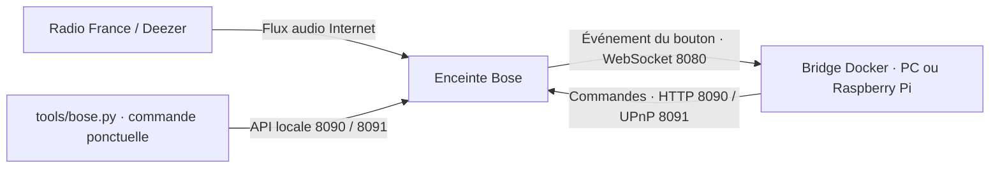

# Bose SoundTouch : radios et multiroom

Faire fonctionner les boutons des trois SoundTouch 10 avec un petit bridge
Docker sur le réseau de la maison. Aucun Home Assistant ni MQTT n'est nécessaire.

| Bouton | Lecture | Qui s'en charge ? |
| --- | --- | --- |
| **1** | France Inter en direct | Le bridge lance la radio |
| **2** | France Info en direct | Le bridge lance la radio |
| **3** | [Playlist Deezer France Inter](https://www.deezer.com/fr/playlist/1227352431) | La Bose, via son compte Deezer |
| **4–5** | Vides, réservés pour un futur usage | Aucune affectation |
| **6 sur Veranda** | Activer / désactiver le groupe des trois Bose | Extension locale du bridge |
| **6 sur Cuisine / Chambre** | Vide | Aucune affectation |

Le bouton 3 est déjà mémorisé sur les trois enceintes. Installer ce dépôt sur
une nouvelle machine conserve cette affectation ; cela ne configure pas Deezer
sur d'autres enceintes.
Les presets 4/5 et le 6 des deux autres Bose restent vides. Le bouton 6 de
Veranda contient un repère technique pour transmettre ses appuis au bridge.

## Comment ça fonctionne

Docker lance **un conteneur**, service `bose-bridge`, qui exécute
`python3 -u /local/bridge/run.py`. Ce petit adaptateur local démarre le
[bridge communautaire de sandervg](https://github.com/sandervg/homeassistant-bose-soundtouch-bridge),
version **1.8.5**, dont l'image est fixée par empreinte dans `compose.yaml`.
Ce dépôt fournit sa configuration, la bascule de groupe sur le bouton 6 et un
outil de commande complémentaire. Les dossiers `bridge/` et `tools/` sont montés
en lecture seule dans le conteneur ; conserver ces dossiers lors de l'installation.

1. Le bridge se connecte à chaque enceinte et attend les événements de ses boutons.
2. Un appui court sur **1 ou 2** lui fait envoyer l'adresse de la radio à cette Bose.
3. **La Bose télécharge et lit elle-même le flux audio.** Le son ne transite pas par le PC ou le Raspberry Pi.



### Quels ports ?

**Le bridge n'ouvre aucun serveur TCP sur l'hôte : aucun port d'interface web
ou d'API à visiter.** Il ouvre des connexions sortantes vers les ports des Bose :

| Port sur chaque Bose | Usage |
| --- | --- |
| **8080/TCP** | Connexion WebSocket persistante : recevoir les appuis sur les boutons |
| **8090/TCP** | API Bose : informations, presets et commandes natives |
| **8091/TCP** | UPnP : demander la lecture d'une radio |

Le conteneur partage le réseau de l'hôte (`network_mode: host`). La découverte
UPnP peut aussi utiliser SSDP, multicast UDP vers le port 1900. Tout reste sur
le LAN pour le pilotage ; Internet est nécessaire pour les radios et Deezer.
Aucune redirection de ports sur la box n'est nécessaire.

### Faut-il laisser la machine allumée ?

**Oui, pour les radios sur 1/2 et la bascule du groupe sur 6.**
Docker maintient le bridge en arrière-plan, même après fermeture du terminal.
Si le bridge s'arrête, une lecture déjà lancée peut continuer. Le bouton 3 Deezer
et le groupe Bose fonctionnent nativement dans les enceintes.

## Installation sur Raspberry Pi

Prévoir un Pi compatible **ARM64**, avec **Raspberry Pi OS 64 bits**, sur le même
LAN que les Bose. L'image choisie existe pour `linux/arm64` et `linux/amd64` ;
aucune compilation n'est nécessaire. Le déploiement sur Pi reste à tester.

1. Installer Docker Engine et le plugin Compose en suivant la
   [procédure officielle Debian pour Raspberry Pi OS 64 bits](https://docs.docker.com/engine/install/debian/).
   Installer aussi Git et Python 3.10 ou plus pour l'utilitaire local :

   ```bash
   sudo apt update
   sudo apt install -y git python3
   sudo systemctl enable --now docker
   docker compose version
   ```

2. Après publication du dépôt, remplacer `VOTRE_COMPTE` ci-dessous :

   ```bash
   git clone https://github.com/VOTRE_COMPTE/bose.git
   cd bose
   docker compose config --quiet
   docker compose pull
   ```

3. Vérifier les IP des enceintes dans `compose.yaml` (`SPEAKERS_JSON`). Pour ce
   réseau, réserver ces adresses dans la box afin qu'elles restent stables :

   | Enceinte | Adresse |
   | --- | --- |
   | Bose Veranda | `192.168.0.152` |
   | Bose Cuisine | `192.168.0.151` |
   | Bose Chambre | `192.168.0.111` |

   Si les IP changent, adapter aussi `GROUP_MASTER_HOST` dans le Compose et la
   liste `HOSTS` de `tools/bose.py`.

4. **Avant de démarrer sur le Pi, arrêter l'ancien bridge sur le PC** avec
   `docker compose down`, depuis son dossier `bose`. Une seule instance doit
   piloter ces enceintes pour éviter des commandes de lecture concurrentes.

5. Sur le Pi, avec les Bose accessibles :

   ```bash
   docker compose up -d
   docker compose logs --tail 50 -f
   ```

   Attendre un message `ws connected` pour chaque IP, puis essayer les boutons.
   `Ctrl+C` quitte l'affichage des logs, pas le bridge. Si Docker demande des
   droits supplémentaires, préfixer les commandes `docker` par `sudo`.

La politique `restart: unless-stopped` relance le conteneur avec Docker après
un redémarrage du Pi, sauf s'il a été arrêté volontairement. Garder le Pi allumé
et éviter sa mise en veille. Si une Bose était indisponible au démarrage et
n'apparaît pas connectée dans les logs, la rallumer puis lancer
`docker compose restart`.

## Utilisation et réglages

Les noms et adresses des radios sont dans [`config/radios.env`](config/radios.env).
Après modification, appliquer la configuration avec `docker compose up -d`.
Les boutons **1/2 ne sont pas réécrits au démarrage** : le bridge charge leurs
URL et utilise les événements des presets déjà enregistrés. Le bouton **3 Deezer
reste mémorisé dans chaque Bose**, indépendamment du bridge.
L'extension vérifie uniquement le repère **6 de Veranda** et le recrée si
nécessaire ; elle ne forme pas de groupe au démarrage. La synchronisation
générale `SYNC_PRESETS_ON_STARTUP` reste désactivée.
Laisser `PRESET_3_URL` vide : la page Deezer n'est pas une URL de flux radio.

```bash
docker compose ps                 # État du conteneur
docker compose logs --tail 50      # Connexions et derniers appuis
docker compose restart            # Redémarrer le bridge
docker compose down               # Arrêter et retirer le conteneur
```

L'arrêt du conteneur ne supprime ni les presets ni le groupe Bose. Les logs sont
limités à trois fichiers de 5 Mo. Un conteneur « Up » doit aussi avoir ses
connexions `ws connected` pour rendre les boutons opérationnels.

## À quoi sert tools/bose.py ?

C'est une **télécommande et un outil de diagnostic en ligne de commande**,
**écrit par Codex pendant la mise en place de ce projet**. Il est distinct du
bridge communautaire et utilise uniquement la bibliothèque standard Python.
Il communique directement avec les enceintes, sans passer par le conteneur.
Lancé à la main, il s'exécute ponctuellement puis se termine. L'extension du
conteneur importe aussi ses fonctions de commande du groupe, écrites en Python.

Depuis ce dossier, sur le Pi ou un autre ordinateur du LAN :

```bash
python3 tools/bose.py status                         # État de Veranda par défaut
python3 tools/bose.py --host 192.168.0.151 status      # État de Cuisine
python3 tools/bose.py probe                          # Tester les trois ports de Veranda
python3 tools/bose.py key 1                          # Simuler le bouton 1 (bridge requis)
python3 tools/bose.py key 3                          # Simuler le bouton 3 Deezer
python3 tools/bose.py key 6                          # Simuler la bascule sur Veranda (bridge requis)
python3 tools/bose.py radio 1                        # Lancer directement France Inter, sans bridge
python3 tools/bose.py --help
```

## Multiroom ou enceintes individuelles

Le **groupe Bose natif** synchronise Cuisine et Chambre sur **Veranda**.
En groupe, changer la musique avec les boutons **1, 2 ou 3 de Veranda**.
Un **appui court sur 6 de Veranda** regroupe les trois enceintes ; l'appui suivant
les sépare. L'extension relit l'état réel du groupe à chaque fois, même après
redémarrage du bridge ou une commande manuelle. Attendre la fin de la bascule
avant un nouvel appui. Une courte reprise audio peut être nécessaire : la Bose
traite nativement le repère 6 comme une sélection de source, puis le bridge
rétablit la musique précédente. Depuis la veille, choisir d'abord 1, 2 ou 3.

Pour écouter séparément, quitter le groupe puis utiliser les boutons de chaque Bose.

```bash
python3 tools/bose.py zone join     # Grouper les trois autour de Veranda
python3 tools/bose.py zone leave    # Séparer les trois enceintes
python3 tools/bose.py zone status   # Vérifier le groupe
python3 tools/bose.py zone toggle   # Basculer directement, sans simuler le bouton
```

Ces commandes ne modifient pas les presets. Le groupe est créé à la demande ;
le bridge ne le recrée pas automatiquement. La synchronisation a été confirmée
à l'écoute pour France Inter, France Info et Deezer. La création et la séparation
par le bouton 6 ont été testées par appuis simulés avec Deezer et France Inter.
Le comportement après reboot des enceintes et les boutons des secondaires en
groupe restent à valider sur le matériel.

## Contenu du dépôt

- [`compose.yaml`](compose.yaml) : lancement du bridge Docker.
- [`config/radios.env`](config/radios.env) : configuration des deux radios.
- [`tools/bose.py`](tools/bose.py) : commandes manuelles, diagnostic et fonctions du groupe.
- [`bridge/`](bridge/) : extension locale pour le bouton 6 de Veranda.
- `tests/` : tests de l'outil local.

Les archives locales `misc/` (dont l'historique `misc/MISC.md`), logs et sauvegardes
sont exclus de Git. L'image
Docker contient déjà le bridge et ses dépendances ; ces archives sont inutiles
pour installer sur le Pi.
