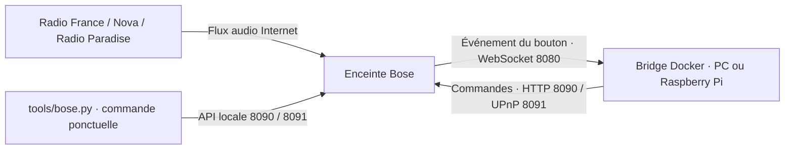

# Bose SoundTouch : radios

Faire fonctionner les boutons des trois SoundTouch 10 avec un petit bridge
Docker sur le réseau de la maison. Aucun Home Assistant ni MQTT n'est nécessaire.

| Bouton | Lecture | Qui s'en charge ? |
| --- | --- | --- |
| **1** | France Inter en direct | Le bridge lance la radio |
| **2** | France Info en direct | Le bridge lance la radio |
| **3** | Radio Nova en direct | Le bridge lance la radio |
| **4** | FIP en direct | Le bridge lance la radio |
| **5** | Radio Paradise (Main Mix) | Le bridge lance la radio |
| **6** | Vide, réservé pour un futur usage | Aucune affectation |

Le bouton 6 est vide sur les trois enceintes.

## Comment ça fonctionne

Docker lance **un conteneur**, service `bose-bridge`, qui exécute
`python3 -u /bridge.py`, la commande standard de l'image du
[bridge communautaire de sandervg](https://github.com/sandervg/homeassistant-bose-soundtouch-bridge),
version **1.8.5**, dont l'image est fixée par empreinte dans `compose.yaml`.
Ce dépôt fournit sa configuration et un outil de commande complémentaire.
Le conteneur utilise directement le bridge communautaire.

1. Le bridge se connecte à chaque enceinte et attend les événements de ses boutons.
2. Un appui court sur **1 à 5** lui fait envoyer l'adresse de la radio à cette Bose.
3. **La Bose télécharge et lit elle-même le flux audio.** Le son ne transite pas par le PC ou le Raspberry Pi.



### Quels ports ?

**Le bridge n'ouvre aucun serveur TCP sur l'hôte : aucun port d'interface web
ou d'API à visiter.** Il ouvre des connexions sortantes vers les ports des Bose :

| Port sur chaque Bose | Usage |
| --- | --- |
| **8080/TCP** | Connexion WebSocket persistante : recevoir les appuis sur les boutons |
| **8090/TCP** | API Bose : informations, presets et commandes natives |
| **8091/TCP** | UPnP : demander la lecture d'une radio |

Le conteneur partage le réseau de l'hôte (`network_mode: host`). La découverte
UPnP peut aussi utiliser SSDP, multicast UDP vers le port 1900. Tout reste sur
le LAN pour le pilotage ; Internet est nécessaire pour les radios.
Aucune redirection de ports sur la box n'est nécessaire.

Le port **17000/TCP** des enceintes donne aussi accès à une console de diagnostic
Telnet, utilisée pour le [redémarrage d’une Bose](#redémarrer-une-enceinte-bose).
Le bridge n’utilise pas ce port.

### Faut-il laisser la machine allumée ?

**Oui, pour les radios sur 1 à 5.**
Docker maintient le bridge en arrière-plan, même après fermeture du terminal.
Si le bridge s'arrête, une lecture déjà lancée peut continuer.

## Installation sur Raspberry Pi

Prévoir un Pi compatible **ARM64**, avec **Raspberry Pi OS 64 bits**, sur le même
LAN que les Bose. L'image choisie existe pour `linux/arm64` et `linux/amd64` ;
aucune compilation n'est nécessaire. Le bridge a été installé sur un Raspberry Pi 5.

1. Installer Docker Engine et le plugin Compose en suivant la
   [procédure officielle Debian pour Raspberry Pi OS 64 bits](https://docs.docker.com/engine/install/debian/).
   Installer aussi Git et Python 3.10 ou plus pour l'utilitaire local :

   ```bash
   sudo apt update
   sudo apt install -y git python3
   sudo systemctl enable --now docker
   docker compose version
   ```

2. Cloner le dépôt GitHub :

   ```bash
   git clone https://github.com/orel33/bose.git
   cd bose
   docker compose config --quiet
   docker compose pull
   ```

3. Vérifier les IP des enceintes dans `compose.yaml` (`SPEAKERS_JSON`). Pour ce
   réseau, réserver ces adresses dans la box afin qu'elles restent stables :

   | Enceinte | Adresse |
   | --- | --- |
   | Bose Cuisine | `192.168.0.151` |
   | Bose Veranda | `192.168.0.152` |
   | Bose Chambre | `192.168.0.153` |

   Si les IP changent, adapter aussi la liste `HOSTS` de `tools/bose.py`.

4. **Avant de démarrer sur le Pi, arrêter l'ancien bridge sur le PC** avec
   `docker compose down`, depuis son dossier `bose`. Une seule instance doit
   piloter ces enceintes pour éviter des commandes de lecture concurrentes.

5. Sur le Pi, avec les Bose accessibles :

   ```bash
   docker compose up -d
   docker compose logs --tail 50 -f
   ```

   Attendre un message `ws connected` pour chaque IP, puis essayer les boutons.
   `Ctrl+C` quitte l'affichage des logs, pas le bridge. Si Docker demande des
   droits supplémentaires, préfixer les commandes `docker` par `sudo`.

La politique `restart: unless-stopped` relance le conteneur avec Docker après
un redémarrage du Pi, sauf s'il a été arrêté volontairement. Garder le Pi allumé
et éviter sa mise en veille. Si une Bose était indisponible au démarrage et
n'apparaît pas connectée dans les logs, la rallumer puis lancer
`docker compose restart`.

## Mettre à jour le bridge sur le RPI5

Après avoir commité et poussé les modifications depuis le PC, exécuter dans un
terminal sur le Pi :

```bash
cd ~/bose
git pull --ff-only
docker compose config --quiet
docker compose up -d
docker compose logs --tail 50
```

Continuer seulement si chaque commande réussit. Si Git signale des modifications
locales, les examiner et les conserver avant de reprendre la mise à jour.
`docker compose up -d` prend en compte les changements de `compose.yaml` et de
`config/radios.env` ; un simple `docker compose restart` ne recharge pas les
variables d’environnement modifiées.

Vérifier un message `ws connected` pour chaque enceinte. La mise à jour du dépôt
et du conteneur ne mémorise pas de nouveaux presets dans les enceintes, car
`SYNC_PRESETS_ON_STARTUP=false`.

## Utilisation et réglages

Les noms et adresses des radios sont dans [`config/radios.env`](config/radios.env).
Après modification, appliquer la configuration avec `docker compose up -d`.
Les boutons **1 à 5 ne sont pas réécrits au démarrage** : le bridge charge leurs
URL et utilise les événements des presets déjà enregistrés.
La synchronisation `SYNC_PRESETS_ON_STARTUP` reste désactivée : le bridge
ne modifie aucun preset au démarrage.
Le bouton 6 reste sans URL. Les presets 3/4/5 sont enregistrés sur chaque
enceinte en `LOCAL_INTERNET_RADIO` avec le nom et l’URL de la radio. Un bouton
vide n’émet pas l’événement attendu : ajouter son URL au fichier ne suffit pas
pour l’activer sur une nouvelle enceinte.

```bash
docker compose ps                 # État du conteneur
docker compose logs --tail 50      # Connexions et derniers appuis
docker compose restart            # Redémarrer le bridge
docker compose down               # Arrêter et retirer le conteneur
```

L'arrêt du conteneur ne supprime pas les presets. Les logs sont
limités à trois fichiers de 5 Mo. Un conteneur « Up » doit aussi avoir ses
connexions `ws connected` pour rendre les boutons opérationnels.

### Activer un bouton auparavant vide

Il faut à la fois configurer son URL dans `config/radios.env`, appliquer cette
configuration au bridge et enregistrer un preset sur l’enceinte via
`POST /storePreset`. Sur cette installation, les presets 3/4/5 ont déjà été
mémorisés sur les trois Bose ; il n’est pas nécessaire de les recréer après
chaque `git pull`.

**Un redémarrage de l’enceinte peut être nécessaire pour activer physiquement un
nouveau bouton.** Lors du test sur Veranda du 25 septembre 2026 :

- Le bouton 3, déjà actif avec RTL2, a lancé Nova sans redémarrage.
- Les nouveaux presets 4 (FIP) et 5 (Radio Paradise) étaient visibles dans l’API
  et fonctionnaient avec des appuis simulés, mais pas avec les boutons physiques.
- Après un débranchement/rebranchement de Veranda, les boutons 4 et 5 ont fonctionné.

Cela suggère un état interne à recharger pour les boutons auparavant vides ; la
cause précise n’a pas été établie. Ce constat ne signifie pas que tout changement
de radio impose un redémarrage.

Pour valider une affectation, **tester un appui court sur le bouton physique**
après reconnexion. La présence du preset dans `/presets` ou le succès de
`python3 tools/bose.py key 4` ne suffisent pas. Dans les logs du bridge, chercher
`physical preset button 4 detected`, puis `playing local preset 4`. Le mot
`physical` apparaît aussi pour les appuis simulés : faire le test sans commande
réseau concurrente et vérifier le son.

## Redémarrer une enceinte Bose

Le redémarrage de l’enceinte est distinct de celui du bridge :
`docker compose restart` redémarre seulement le conteneur sur le Pi.

### Avec tools/bose.py

Depuis le dossier du projet, sur le PC ou le Pi connecté au même réseau :

```bash
# Redémarrer uniquement Bose Cuisine
python3 tools/bose.py --host 192.168.0.151 reboot
```

Remplacer l’adresse par `192.168.0.152` pour Veranda ou `192.168.0.153` pour
Chambre. Sans `--host`, l’outil cible **Veranda**, comme ses autres commandes.

La commande agit immédiatement sur l’enceinte sélectionnée : elle attend
l’invite `->` de la console du port 17000, puis envoie `sys reboot`. Elle utilise
uniquement Python, sans client Telnet à installer et sans SSH. Une console
inaccessible ou sans invite provoque une erreur avant l’envoi. La commande n’est
pas réessayée automatiquement si l’envoi échoue.

Le message de succès indique que la commande a été envoyée, pas que l’enceinte
est déjà revenue. Attendre environ une minute puis exécuter :

```bash
python3 tools/bose.py --host 192.168.0.151 status
```

La commande a été testée avec une console simulée ; aucun redémarrage réel n’a
été lancé pendant son développement.

### Par la console Telnet

Depuis le PC ou le Pi, sur le même réseau local, ouvrir la console de l’enceinte
souhaitée. Pour **Bose Cuisine** :

```bash
telnet 192.168.0.151 17000
```

À l’invite `->`, saisir :

```text
sys reboot
```

La commande lance un redémarrage du système, sans réinitialisation des réglages.
La connexion se coupe ; compter environ 45 à 60 secondes avant le retour de
l’API, parfois davantage pour la reconnexion Wi-Fi. C’est une connexion **Telnet
directe à la Bose**, sans SSH ni connexion au Raspberry Pi.

| Enceinte | Commande de connexion |
| --- | --- |
| Cuisine | `telnet 192.168.0.151 17000` |
| Veranda | `telnet 192.168.0.152 17000` |
| Chambre | `telnet 192.168.0.153 17000` |

Si le client Telnet manque, l’installer avec `sudo apt install telnet` sur
Debian, Ubuntu ou Raspberry Pi OS. La console n’accepte qu’une session à la fois.

La commande `sys reboot` est décrite dans la
[documentation BoseSoundTouchApi, méthode RebootDevice](https://bosesoundtouchapi.readthedocs.io/en/latest/bosesoundtouchapi/soundtouchdevice.html#SoundTouchDevice.RebootDevice).
Sur Cuisine, le port 17000 et l’invite `->` ont été vérifiés le 25 septembre 2026 ;
**aucun redémarrage Telnet n’a été exécuté lors de cette vérification**.

### Par l’alimentation

Si la console est inaccessible, débrancher puis rebrancher l’alimentation de
l’enceinte et attendre sa reconnexion Wi-Fi. C’est la méthode qui a rétabli les
boutons 4 et 5 sur Veranda.

### Vérifier après le redémarrage

Depuis le dossier du projet, vérifier que Cuisine répond :

```bash
python3 tools/bose.py --host 192.168.0.151 status
```

Sur le Pi, vérifier la reconnexion du bridge :

```bash
cd ~/bose
docker compose logs --tail 50
```

Si aucune nouvelle connexion `ws connected` n’apparaît pour l’enceinte alors
qu’elle répond à nouveau, lancer `docker compose restart` sur le Pi. Enfin,
essayer physiquement les boutons 4 et 5 et vérifier la lecture de FIP et de
Radio Paradise.

## Flux radio et écoute directe sous Linux

Les adresses ci-dessous correspondent à [`config/radios.env`](config/radios.env).
Les cinq flux sont au format MP3, à 128 kbit/s.

| Bouton | Radio | URL du flux | Destination après redirection |
| --- | --- | --- | --- |
| **1** | France Inter | `http://direct.franceinter.fr/live/franceinter-midfi.mp3` | `http://icecast.radiofrance.fr/franceinter-midfi.mp3` |
| **2** | France Info | `http://direct.franceinfo.fr/live/franceinfo-midfi.mp3` | `http://icecast.radiofrance.fr/franceinfo-midfi.mp3` |
| **3** | Radio Nova | `http://novazz.ice.infomaniak.ch/novazz-128.mp3` | Aucune lors de la vérification |
| **4** | FIP | `http://direct.fipradio.fr/live/fip-midfi.mp3` | `http://icecast.radiofrance.fr/fip-midfi.mp3` |
| **5** | Radio Paradise | `http://stream.radioparadise.com/mp3-128` | Aucune lors de la vérification |

Pour écouter sur l'ordinateur Linux, installer **mpv**. Sur Debian, Ubuntu ou
Raspberry Pi OS :

```bash
sudo apt install mpv
```

Lancer **une** des commandes suivantes dans un terminal :

```bash
# France Inter
mpv --no-video 'http://direct.franceinter.fr/live/franceinter-midfi.mp3'

# France Info
mpv --no-video 'http://direct.franceinfo.fr/live/franceinfo-midfi.mp3'

# Radio Nova
mpv --no-video 'http://novazz.ice.infomaniak.ch/novazz-128.mp3'

# FIP
mpv --no-video 'http://direct.fipradio.fr/live/fip-midfi.mp3'

# Radio Paradise
mpv --no-video 'http://stream.radioparadise.com/mp3-128'
```

Appuyer sur **q** ou **Ctrl+C** pour arrêter. Cette écoute utilise la sortie audio
de l'ordinateur, sans Docker ni enceinte Bose. Les redirections sont suivies
automatiquement ; ce lecteur ne supprime pas les éventuelles publicités du flux.
Voir la [documentation de mpv](https://mpv.io/manual/stable/).

Avec **VLC**, ouvrir **Média → Ouvrir un flux réseau**, puis coller l'URL de la
radio souhaitée. Depuis un terminal, on peut aussi lancer :

```bash
vlc 'http://novazz.ice.infomaniak.ch/novazz-128.mp3'
```

## À quoi sert tools/bose.py ?

C'est une **télécommande et un outil de diagnostic en ligne de commande**,
**écrit par Codex pendant la mise en place de ce projet**. Il est distinct du
bridge communautaire et utilise uniquement la bibliothèque standard Python.
Il communique directement avec les enceintes, sans passer par le conteneur.
Lancé à la main, il s'exécute ponctuellement puis se termine.

Depuis ce dossier, sur le Pi ou un autre ordinateur du LAN :

```bash
python3 tools/bose.py status                         # État de Veranda par défaut
python3 tools/bose.py --host 192.168.0.151 status      # État de Cuisine
python3 tools/bose.py probe                          # Tester les trois ports de Veranda
python3 tools/bose.py --host 192.168.0.151 reboot      # Redémarrer Cuisine via Telnet
python3 tools/bose.py key 1                          # Simuler le bouton 1 (bridge requis)
python3 tools/bose.py key 3                          # Simuler le bouton 3 Nova
python3 tools/bose.py radio 1                        # Lancer directement France Inter, sans bridge
python3 tools/bose.py radio 4                        # Lancer directement FIP
python3 tools/bose.py radio 5                        # Lancer directement Radio Paradise
python3 tools/bose.py --help
```

## Contenu du dépôt

- [`compose.yaml`](compose.yaml) : lancement du bridge Docker.
- [`config/radios.env`](config/radios.env) : configuration des cinq radios.
- [`tools/bose.py`](tools/bose.py) : commandes manuelles et diagnostic.
- `tests/` : tests de l'outil local.

Les archives locales `misc/` (dont l'historique `misc/MISC.md`), logs et sauvegardes
sont exclus de Git. L'image
Docker contient déjà le bridge et ses dépendances ; ces archives sont inutiles
pour installer sur le Pi.
